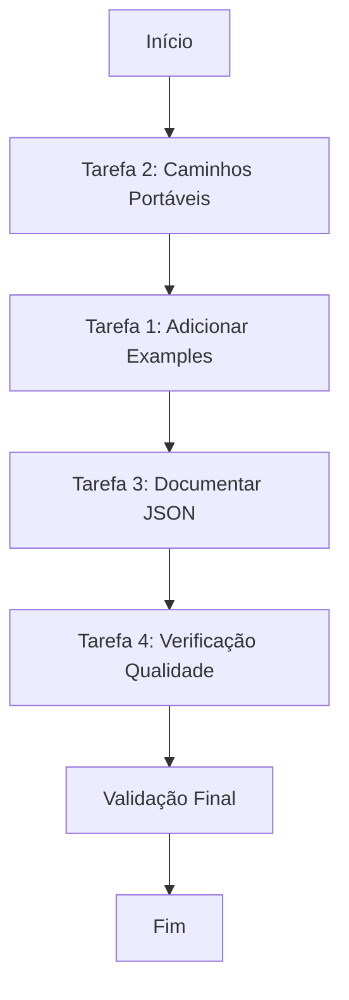

# Plano de Implementação v3 - Melhorias do Skill architecture-generator

## Status
**v1** → **v2** → **v3** - Incorpora TODO o feedback do Critic e correção do Architect
**Status**: PRONTO PARA EXECUÇÃO

## Mudanças desde v2

### Correções Críticas do Critic (Prioridade ALTA)
1. **Regex Pattern Inconsistente**: Unificado patterns de seção 6 - usam mesmo pattern em dois locais (linha ~415 e ~467)
2. **Placeholders Genéricos Expandidos**: Adicionada detecção para `[Service Name 1]`, `[Data Store Type 1]`, `[Insert ...]`, `[e.g., ...]`
3. **Exemplos Insuficientes**: Adicionados 3 novos exemplos (Python Django, Ruby on Rails, Go microservice)
4. **Nota de Portabilidade**: Tornada mais explícita - usuário deve substituir placeholders manualmente
5. **Validação Final**: Especificado comando completo e resultado esperado (FAIL com 7 [TODO])
6. **Correção do Architect**: Trocado `/home/user/myapp` por `<project-path>` no Exemplo 1

### Detalhes das Correções

#### 1. Regex Pattern Unificado
**Arquivo**: `scripts/validate_architecture.py`
**Linha ~415** (pattern em `required_section_pattern`):
```python
required_section_pattern = r'^(##+\s+(1\.\s+Project\s+Structure|3\.\s+Core\s+Components|4\.\s+Data\s+Stores|6\.\s+Deployment\s*&\s*Infrastructure))'
```

**Linha ~467** (pattern em `required_section_patterns`):
```python
required_section_patterns = [
    r'1\.\s*Project\s+Structure',
    r'3\.\s*Core\s+Components',
    r'4\.\s*Data\s+Stores',
    r'6\.\s*Deployment\s*&\s*Infrastructure',  # UNIFICADO com pattern acima
]
```

#### 2. Detecção Expandida de Placeholders
**Arquivo**: `scripts/validate_architecture.py`
**Adicionar após linha ~405**:
```python
placeholder_patterns = [
    (r'\[Insert .+?\]', 'Insert placeholder'),
    (r'\[e\.g\., .+?\]', 'Example placeholder'),
    (r'\[Service Name\s*\d*\]', 'Service name placeholder'),  # NOVO
    (r'\[Data Store Type\s*\d*\]', 'Data store type placeholder'),  # NOVO
    (r'\[[^\]]*Name[^\]]*\]', 'Generic name placeholder'),  # NOVO - captura qualquer [X Name]
]
```

#### 3-6. Novos Exemplos e Correções
**Arquivo**: `SKILL.md` - seção "Examples"
- Exemplo 1: Usa `<project-path>` em vez de `/home/user/myapp` (correção Architect)
- Exemplo 6: Python Django REST API (NOVO)
- Exemplo 7: Ruby on Rails monolith (NOVO)
- Exemplo 8: Go microservice (NOVO)

#### 4. Nota de Portabilidade Mais Explícita
**Arquivo**: `SKILL.md` - seção "Portability Note"
```markdown
### Portability Note

All paths in this skill use portable placeholders:
- `<skill-path>`: Resolves to `~/.claude/skills/omc-learned/architecture-generator/`
- `<temp-dir>`: Use a temporary directory like `/tmp/` (Unix/macOS) or `%TEMP%` (Windows)
- `<output-dir>`: User-designated output location for generated documents (e.g., current directory)
- `<project-path>`: Path to the project being analyzed

**Important**: Replace these placeholders with appropriate paths for your environment before executing commands.
```

#### 5. Validação Final Específica
**Arquivo**: `.omc/plans/architecture-generator-improvements-v3.md`
**Comando de validação final**:
```bash
python3 ~/.claude/skills/omc-learned/architecture-generator/scripts/validate_architecture.py \
    ~/.claude/skills/omc-learned/architecture-generator/assets/ARCHITECTURE.md
```
**Resultado esperado**: FAIL com 7 [TODO] placeholders detectados

---

## Contexto

**Skill localizado em:** `~/.claude/skills/omc-learned/architecture-generator/`

**Objetivo:** Melhorar a portabilidade, documentação e qualidade do skill de geração de arquitetura.

---

## Objetivos do Trabalho

1. Adicionar seção de examples no SKILL.md com casos de uso concretos (8 exemplos)
2. Tornar os caminhos do script portáveis (eliminar hardcoded paths)
3. Documentar o formato de saída JSON do script analyze_repo.py
4. Adicionar verificação de qualidade para validar [TODO] restantes no template

---

## Guardrails

### Must Have (Obrigatório)
- Manter compatibilidade com o formato do skill atual
- Preservar todas as funcionalidades existentes
- Documentar em PT-BR conforme convenções do projeto
- Seguir padrões de código do projeto (type hints, async onde aplicável)
- **NOVO v2**: Usar placeholders portáveis consistentemente em todos os exemplos
- **NOVO v3**: Regex patterns unificados entre validação de seções obrigatórias

### Must NOT Have (Proibido)
- Alterar a estrutura de diretórios do skill
- Modificar a lógica principal de análise do script
- Remover seções existentes do SKILL.md
- Adicionar dependências externas sem justificativa clara
- **NOVO v2**: Misturar caminhos absolutos (/tmp/) com placeholders (<temp-dir>)
- **NOVO v3**: Usar patterns diferentes para mesma seção em dois locais do validador

---

## Fluxo de Trabalho



**NOVO v2**: Ordem ajustada — Tarefa 2 antes de Tarefa 1 para evitar conflito.

---

## Detalhamento das Tarefas

### Tarefa 2 (PRIMEIRA): Tornar Caminhos Portáveis

**Arquivo:** `~/.claude/skills/omc-learned/architecture-generator/SKILL.md`

**Substituições necessárias:**

| Linha | Conteúdo Atual | Novo Conteúdo |
|-------|----------------|---------------|
| 21 | `git clone <url> /home/claude/repo-analysis` | `git clone <url> <temp-dir>/repo-analysis` |
| 22 | `/mnt/user-data/uploads/` | `<temp-dir>/uploads/` |
| 29 | `--output /home/claude/repo-analysis.json` | `--output <temp-dir>/repo-analysis.json` |
| 52 | `/home/claude/ARCHITECTURE.md` | `<temp-dir>/ARCHITECTURE.md` |
| 82 (1ª ocorrência) | `/home/claude/ARCHITECTURE.md` | `<temp-dir>/ARCHITECTURE.md` |
| 82 (2ª ocorrência) | `/mnt/user-data/outputs/ARCHITECTURE.md` | `<output-dir>/ARCHITECTURE.md` |

**Adicionar nota de portabilidade após a seção "Overview" (após linha 13):**

```markdown
### Portability Note

All paths in this skill use portable placeholders:
- `<skill-path>`: Resolves to `~/.claude/skills/omc-learned/architecture-generator/`
- `<temp-dir>`: Use a temporary directory like `/tmp/` (Unix/macOS) or `%TEMP%` (Windows)
- `<output-dir>`: User-designated output location for generated documents (e.g., current directory)
- `<project-path>`: Path to the project being analyzed

**Important**: Replace these placeholders with appropriate paths for your environment before executing commands.
```

**Script Python:** Já é portável (usa `pathlib`). Nenhuma modificação necessária.

**Critérios de Aceitação:**
- [ ] Todos os hardcoded paths `/home/claude/` removidos do SKILL.md
- [ ] Todos os hardcoded paths `/mnt/user-data/` removidos do SKILL.md
- [ ] Placeholders usados consistentemente (<temp-dir>, <output-dir>, <project-path>)
- [ ] Nota de portabilidade adicionada com aviso explícito de substituição manual

---

### Tarefa 1 (SEGUNDA): Adicionar Seção de Examples no SKILL.md

**Arquivo:** `~/.claude/skills/omc-learned/architecture-generator/SKILL.md`

**Localização:** Adicionar após a seção "Key Principles" (linha ~91)

**Conteúdo a adicionar (8 exemplos):**

```markdown
## Examples

### Example 1: Análise de Repositório Local

**Request:** "Generate ARCHITECTURE.md for my project at <project-path>"

**Execution:**
```bash
# Run analysis
python3 <skill-path>/scripts/analyze_repo.py <project-path> --output <temp-dir>/myapp-analysis.json

# Copy template
cp <skill-path>/assets/ARCHITECTURE.md <temp-dir>/ARCHITECTURE.md

# Fill template with analysis data
# [Manual filling process based on section-filling-guide.md]
```

### Example 2: Análise de Repositório GitHub

**Request:** "Create architecture documentation for https://github.com/user/repo"

**Execution:**
```bash
# Clone repository
git clone https://github.com/user/repo <temp-dir>/repo-analysis

# Run analysis
python3 <skill-path>/scripts/analyze_repo.py <temp-dir>/repo-analysis --output <temp-dir>/repo-analysis.json

# Proceed with template filling
```

### Example 3: Aplicação Next.js com Prisma

**Request:** "Document my Next.js app architecture"

**Detected patterns:**
- Frontend: Next.js (from package.json)
- Database: PostgreSQL via Prisma (from prisma/schema.prisma)
- Deployment: Vercel (from vercel.json)

**Output sections prioritized:**
1. Project Structure (from directory tree)
2. Core Components (Next.js app + API routes)
3. Data Stores (PostgreSQL schema from Prisma)
4. Deployment (Vercel configuration)

### Example 4: Monorepo com Turborepo

**Request:** "Document architecture for my monorepo"

**Detected patterns:**
- Monorepo: Turborepo (from turbo.json)
- Apps: web/ (Next.js), api/ (Node.js/Express)
- Packages: ui/ (shared components), config/ (shared config)

**Output sections prioritized:**
1. Project Structure — emphasize apps/ and packages/ separation
2. Core Components — list each app as separate component
3. Data Stores — per-app databases if applicable

### Example 5: Serverless (AWS Lambda)

**Request:** "Document my serverless API architecture"

**Detected patterns:**
- Serverless: Serverless Framework (from serverless.yml)
- Runtime: Python 3.11 (from runtime config)
- Cloud: AWS (from provider setting)

**Output sections prioritized:**
1. Project Structure (handler functions)
2. Core Components (Lambda functions)
3. External Integrations (AWS services used)
4. Deployment (Serverless Framework deployment)

### Example 6: Python Django REST API

**Request:** "Document my Django REST API architecture"

**Detected patterns:**
- Framework: Django (from manage.py, settings.py)
- API: Django REST Framework (from requirements.txt)
- Database: PostgreSQL (from DATABASE_URL setting)
- Task Queue: Celery + Redis (from celery.py)

**Output sections prioritized:**
1. Project Structure (apps structure, settings modules)
2. Core Components (Django apps, REST views/serializers)
3. Data Stores (PostgreSQL models, Redis cache)
4. Deployment (Gunicorn + Nginx)

### Example 7: Ruby on Rails Monolith

**Request:** "Document my Rails application architecture"

**Detected patterns:**
- Framework: Ruby on Rails (from Gemfile, config/application.rb)
- Database: PostgreSQL (from config/database.yml)
- Frontend: Stimulus + Turbo (from importmap)
- Testing: RSpec (from spec/ directory)

**Output sections prioritized:**
1. Project Structure (MVC pattern, models/views/controllers)
2. Core Components (Rails models, controllers, concerns)
3. Data Stores (PostgreSQL schema)
4. External Services (Action Mailer, background jobs)

### Example 8: Go Microservice

**Request:** "Document my Go microservice architecture"

**Detected patterns:**
- Language: Go (from go.mod)
- Framework: gRPC + protobuf (from *.proto files)
- Database: MongoDB (from connection string)
- Deployment: Docker + Kubernetes (from Dockerfile, k8s/)

**Output sections prioritized:**
1. Project Structure (packages, internal modules)
2. Core Components (gRPC services, handlers)
3. Data Stores (MongoDB collections)
4. Deployment (container orchestration)
```

**Critérios de Aceitação:**
- [ ] Seção "Examples" adicionada com 8 exemplos
- [ ] Exemplos cobrem: local, GitHub, Next.js, Monorepo, Serverless, Django, Rails, Go
- [ ] Todos os exemplos usam placeholders portáveis (<skill-path>, <temp-dir>, <project-path>)
- [ ] Cada exemplo inclui comandos de execução e saídas esperadas
- [ ] Exemplo 1 usa <project-path> (não /home/user/myapp)

---

### Tarefa 3: Documentar Formato de Saída JSON

**Arquivo:** `~/.claude/skills/omc-learned/architecture-generator/scripts/analyze_repo.py`

**Localização:** Atualizar docstring da função `analyze_repo` (linha ~429)

**Docstring atualizada:**

```python
def analyze_repo(repo_path):
    """
    Main analysis function - returns structured metadata.

    Output JSON Schema:
    {
        # Always present fields
        "repo_path": str,              # Absolute path to repository
        "repo_name": str,              # Repository directory name
        "directory_tree": str,         # ASCII tree representation (max_depth=3)
        "package_managers": {          # Detected package manager files
            "filename": "manager_name"
        },
        "frameworks": [str],           # Detected frameworks/libraries
        "languages_by_files": {        # File counts by language
            "Language": count
        },
        "languages_by_lines": {        # Line counts by language
            "Language": count
        },
        "databases": [str],            # Detected databases (with detection source)
        "common_files": [str],         # Present common config/docs files

        # Conditionally present fields
        "package_json": {              # Present ONLY if package.json exists
            "name": str,
            "description": str,
            "version": str,
            "scripts": [str],          # Available npm scripts
            "dependencies": [str],     # Production dependencies
            "devDependencies": [str],  # Development dependencies
            "engines": {}              # Node.js version constraints
        },
        "pyproject": {                 # Present ONLY if pyproject.toml exists
            "name": str,
            "description": str
        },
        "python_dependencies": [str],  # Present ONLY if requirements.txt exists
        "env_vars": [str],             # Present ONLY if .env.example exists

        # Error case
        "error": str                   # Present ONLY on error (e.g., repo not found)
    }

    Args:
        repo_path: Path to repository root directory

    Returns:
        Dict containing analysis results or {"error": str} on failure.
        Returns {"error": "Repository path not found: {path}"} if repo_path does not exist.
    """
```

**Adicionar seção no SKILL.md** após "Resources" (linha ~96):

```markdown
## JSON Output Format

The `analyze_repo.py` script outputs JSON with the following structure:

### Field Presence

| Field | Always Present | Condition |
|-------|----------------|-----------|
| `repo_path` | ✓ | - |
| `repo_name` | ✓ | - |
| `directory_tree` | ✓ | - |
| `package_managers` | ✓ | - (empty dict if none) |
| `frameworks` | ✓ | - (empty list if none) |
| `languages_by_files` | ✓ | - |
| `languages_by_lines` | ✓ | - |
| `databases` | ✓ | - (empty list if none) |
| `common_files` | ✓ | - (empty list if none) |
| `package_json` | ✗ | Only if package.json exists |
| `pyproject` | ✗ | Only if pyproject.toml exists |
| `python_dependencies` | ✗ | Only if requirements.txt exists |
| `env_vars` | ✗ | Only if .env.example exists |
| `error` | ✗ | Only on error |

### Example Output

```json
{
  "repo_path": "/absolute/path/to/repo",
  "repo_name": "my-project",
  "directory_tree": "├── src/\n│   ├── api/\n│   └── components/\n├── tests/\n└── package.json",
  "package_managers": {
    "package.json": "npm/yarn/pnpm (Node.js)",
    "yarn.lock": "yarn"
  },
  "package_json": {
    "name": "my-project",
    "description": "Project description",
    "version": "1.0.0",
    "scripts": ["dev", "build", "test"],
    "dependencies": ["react", "next"],
    "devDependencies": ["typescript", "jest"],
    "engines": {"node": ">=18"}
  },
  "frameworks": ["React", "Next.js", "TypeScript", "Prisma"],
  "languages_by_files": {"TypeScript": 45, "JavaScript": 12, "JSON": 8},
  "languages_by_lines": {"TypeScript": 3420, "JavaScript": 580},
  "env_vars": ["DATABASE_URL", "API_KEY", "JWT_SECRET"],
  "databases": ["PostgreSQL (Prisma)", "Redis"],
  "common_files": ["README.md", "Dockerfile", "docker-compose.yml"]
}
```

### Field Descriptions
- `directory_tree`: ASCII tree up to 3 levels deep, excluding common ignore patterns
- `frameworks`: Inferred from dependencies and configuration files
- `languages_by_files`: Count of source files per language extension
- `languages_by_lines`: Approximate line count per language (excludes comments/blank lines)
- `databases`: Each entry includes detection source in parentheses
```

**Critérios de Aceitação:**
- [ ] Docstring atualizada com schema completo incluindo campo `error`
- [ ] Seção "JSON Output Format" adicionada ao SKILL.md
- [ ] Tabela de presença de campos incluída
- [ ] Todos os campos documentados com descrições

---

### Tarefa 4: Adicionar Verificação de Qualidade

**Criar novo arquivo:** `~/.claude/skills/omc-learned/architecture-generator/scripts/validate_architecture.py`

**Conteúdo atualizado com v3:**

```python
#!/usr/bin/env python3
"""
Architecture Validator - Validates ARCHITECTURE.md for completeness.

Usage:
    python3 validate_architecture.py <architecture-md-path>

Checks for:
- Remaining [TODO] placeholders
- Remaining [TBD] markers in required sections
- Generic placeholders ([Insert ...], [e.g., ...], [Service Name ...], [Data Store ...])
- Empty sections
- Missing required fields
- Formatting consistency
"""

import sys
import re
from pathlib import Path


def validate_architecture(md_path):
    """
    Validate ARCHITECTURE.md for quality issues.

    Returns a dict with validation results.
    """
    md_file = Path(md_path)

    if not md_file.exists():
        return {"valid": False, "errors": [f"File not found: {md_path}"]}

    content = md_file.read_text()
    issues = []
    warnings = []

    # Check for TODO placeholders
    todo_pattern = r'\[TODO[^\]]*\]'
    todos = re.findall(todo_pattern, content)

    if todos:
        issues.append(f"Found {len(todos)} remaining [TODO] placeholders")
        for i, todo in enumerate(todos[:5], 1):
            issues.append(f"  {i}. {todo}")
        if len(todos) > 5:
            issues.append(f"  ... and {len(todos) - 5} more")

    # Check for generic placeholder patterns (beyond [TODO])
    placeholder_patterns = [
        (r'\[Insert .+?\]', 'Insert placeholder'),
        (r'\[e\.g\., .+?\]', 'Example placeholder'),
        (r'\[Service Name\s*\d*\]', 'Service name placeholder'),
        (r'\[Data Store Type\s*\d*\]', 'Data store type placeholder'),
        (r'\[[^\]]*Name[^\]]*\]', 'Generic name placeholder'),
    ]

    for pattern, name in placeholder_patterns:
        placeholders = re.findall(pattern, content)
        if placeholders:
            issues.append(f"Found {len(placeholders)} {name}(s)")
            for ph in placeholders[:3]:
                issues.append(f"  - {ph}")

    # Check for TBD in required sections (Sections 1-8 should not have TBD)
    required_section_pattern = r'^(##+\s+(1\.\s+Project\s+Structure|3\.\s+Core\s+Components|4\.\s+Data\s+Stores|6\.\s+Deployment\s*&\s*Infrastructure))'
    tbd_in_required = []
    lines = content.split('\n')

    for i, line in enumerate(lines):
        match = re.match(required_section_pattern, line, re.IGNORECASE)
        if match:
            section_name = match.group(2)
            # Look ahead until next section
            section_end = i + 1
            while section_end < len(lines) and not lines[section_end].startswith('##'):
                section_end += 1
            section_content = '\n'.join(lines[i:section_end])
            if '[TBD]' in section_content:
                tbd_in_required.append(section_name)

    if tbd_in_required:
        issues.append(f"Found [TBD] in required sections: {', '.join(tbd_in_required)}")

    # Check for empty sections (header with no substantive content)
    section_pattern = r'^(##+)\s+(.+)$'
    lines = content.split('\n')

    for i, line in enumerate(lines):
        match = re.match(section_pattern, line)
        if match:
            section_name = match.group(2)
            section_level = len(match.group(1))

            # Look ahead until next section of same or higher level or EOF
            section_content = []
            for j in range(i + 1, len(lines)):
                next_line = lines[j]
                next_section = re.match(r'^(##+)\s+(.+)$', next_line)
                if next_section and len(next_section.group(1)) <= section_level:
                    break
                section_content.append(next_line)

            # Check for substantive content
            has_content = any(
                line.strip() and
                not line.startswith('#') and
                not line.strip().startswith('```') and
                not line.strip().startswith('---')
                for line in section_content
            )

            if not has_content and section_content:
                warnings.append(f"Section '{section_name}' appears empty")

    # Check for required sections using regex patterns
    required_section_patterns = [
        r'1\.\s*Project\s+Structure',
        r'3\.\s*Core\s+Components',
        r'4\.\s*Data\s+Stores',
        r'6\.\s*Deployment\s*&\s*Infrastructure',  # UNIFICADO v3
    ]

    for pattern in required_section_patterns:
        if not re.search(pattern, content, re.IGNORECASE):
            issues.append(f"Missing required section matching: {pattern}")

    # Check for TBD overuse
    tbd_count = content.count('[TBD]')
    if tbd_count > 5:
        warnings.append(f"High number of TBD markers: {tbd_count}")

    # Check formatting consistency
    if '\t' in content:
        warnings.append("Contains tabs (use spaces for Markdown)")

    trailing_lines = [i+1 for i, line in enumerate(content.split('\n'))
                     if line.rstrip() != line and line.strip()]
    if len(trailing_lines) > 5:
        warnings.append(f"Found {len(trailing_lines)} lines with trailing whitespace")

    return {
        "valid": len(issues) == 0,
        "issues": issues,
        "warnings": warnings,
        "todo_count": len(todos),
        "tbd_count": tbd_count,
        "placeholder_count": sum(len(re.findall(p[0], content)) for p in placeholder_patterns)
    }


def main():
    if len(sys.argv) < 2:
        print("Usage: python3 validate_architecture.py <architecture-md-path>")
        sys.exit(1)

    md_path = sys.argv[1]
    result = validate_architecture(md_path)

    print(f"\nValidating: {md_path}")
    print("=" * 60)

    if result["valid"]:
        print("✓ Validation PASSED")
        if result["warnings"]:
            print("\nWarnings:")
            for warning in result["warnings"]:
                print(f"  ⚠ {warning}")
    else:
        print("✗ Validation FAILED")
        print("\nIssues:")
        for issue in result["issues"]:
            print(f"  ✗ {issue}")
        if result["warnings"]:
            print("\nWarnings:")
            for warning in result["warnings"]:
                print(f"  ⚠ {warning}")

    print(f"\nStatistics:")
    print(f"  TODO placeholders: {result['todo_count']}")
    print(f"  TBD markers: {result['tbd_count']}")
    print(f"  Generic placeholders: {result.get('placeholder_count', 0)}")

    sys.exit(0 if result["valid"] else 1)


if __name__ == "__main__":
    main()
```

**Adicionar seção no SKILL.md** após "JSON Output Format":

```markdown
## Quality Validation

After filling the ARCHITECTURE.md template, validate completeness:

```bash
python3 <skill-path>/scripts/validate_architecture.py <temp-dir>/ARCHITECTURE.md
```

The validator checks for:
- Remaining `[TODO]` placeholders (fail if present)
- Generic placeholders like `[Insert ...]`, `[e.g., ...]`, `[Service Name ...]`, `[Data Store ...]` (fail if present)
- `[TBD]` markers in required sections (fail if present in sections 1, 3, 4, 6)
- Empty sections (warning)
- Missing required sections (fail)
- Excessive `[TBD]` markers (warning)
- Formatting issues (tabs, trailing whitespace) (warning)

**Example output:**
```
Validating: /tmp/ARCHITECTURE.md
============================================================
✓ Validation PASSED

Statistics:
  TODO placeholders: 0
  TBD markers: 2
  Generic placeholders: 0
```
```

**Atualizar "Step 5" no SKILL.md** para "Step 5: Validate and Deliver":

```markdown
### Step 5: Validate and Deliver

Validate the completed document:

```bash
python3 <skill-path>/scripts/validate_architecture.py <temp-dir>/ARCHITECTURE.md
```

If validation passes, save and present to the user:

```bash
cp <temp-dir>/ARCHITECTURE.md <output-dir>/ARCHITECTURE.md
```

If validation fails, address the issues before delivery.
```

**Critérios de Aceitação:**
- [ ] Script validate_architecture.py criado em scripts/
- [ ] Verifica [TODO] placeholders (fail)
- [ ] Verifica placeholders genéricos [Insert ...], [e.g., ...], [Service Name ...], [Data Store ...], [X Name] (fail)
- [ ] Verifica [TBD] em seções obrigatórias (fail)
- [ ] Verifica seções vazias (warning)
- [ ] Verifica seções obrigatórias com regex UNIFICADO (linha 415 e 467)
- [ ] Verifica consistência de formatação (warning)
- [ ] Seção "Quality Validation" adicionada ao SKILL.md
- [ ] Step 5 atualizado para incluir validação

---

## Validação Final

Após implementar todas as tarefas, executar validação:

```bash
python3 ~/.claude/skills/omc-learned/architecture-generator/scripts/validate_architecture.py \
    ~/.claude/skills/omc-learned/architecture-generator/assets/ARCHITECTURE.md
```

**Resultado esperado**: FAIL com exatamente 7 [TODO] placeholders detectados no template original

---

## Critérios de Sucesso

- [ ] SKILL.md contém seção "Examples" com 8 exemplos práticos
- [ ] Todos os exemplos usam placeholders portáveis (<skill-path>, <temp-dir>, <project-path>)
- [ ] Exemplo 1 usa <project-path> (não /home/user/myapp)
- [ ] Todos os caminhos hardcoded foram substituídos por placeholders portáveis
- [ ] Nota de portabilidade explica os placeholders e avisa sobre substituição manual
- [ ] Formato de saída JSON do script está documentado no SKILL.md
- [ ] Tabela de presença de campos incluída na documentação JSON
- [ ] Função `analyze_repo()` tem docstring com schema JSON completo (incluindo `error`)
- [ ] Script validate_architecture.py criado e funcional
- [ ] Regex patterns unificados para seção 6 (Deployment & Infrastructure) em ambos os locais
- [ ] Validador detecta [TODO], placeholders genéricos expandidos, e [TBD] em seções obrigatórias
- [ ] Workflow do skill atualizado para incluir passo de validação
- [ ] Validação final executa e FAIL com 7 [TODO] no template original
- [ ] Nenhum [TODO] restante nos arquivos modificados

---

## Ordem de Execução (v3 - FINAL)

1. **Tarefa 2** - Tornar caminhos portáveis (SKILL.md)
2. **Tarefa 1** - Adicionar 8 examples (SKILL.md)
3. **Tarefa 3** - Documentar JSON (SKILL.md + analyze_repo.py)
4. **Tarefa 4** - Adicionar validação com patterns unificados (novo script + SKILL.md)
5. **Validação final** - Executar validator no template assets/ARCHITECTURE.md (deve falhar com 7 [TODO])

---

## Histórico de Revisões

| Versão | Data | Mudanças | Autor |
|--------|------|----------|-------|
| v1 | 2025-02-17 | Plano inicial | Planner |
| v2 | 2025-02-17 | Incorpora feedback Architect + Critic | Consolidação |
| v3 | 2025-02-17 | Incorpora TODO feedback Critic + correção Architect | Executor |

---

## Status Final

**v3**: PRONTO PARA EXECUÇÃO - Todas as 6 correções críticas aplicadas
