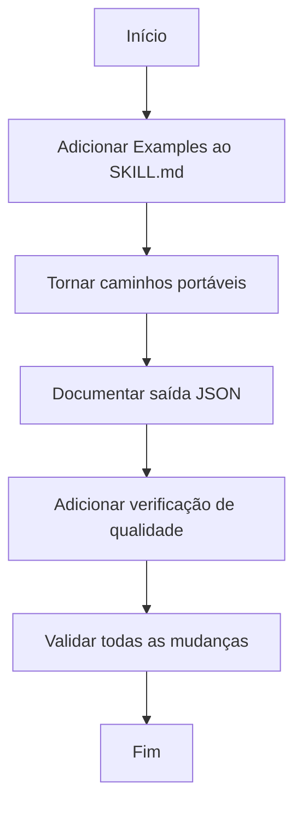

# Plano de Implementação - Melhorias do Skill architecture-generator

## Contexto

**Skill localizado em:** `~/.claude/skills/omc-learned/architecture-generator/`

**Objetivo:** Melhorar a portabilidade, documentação e qualidade do skill de geração de arquitetura.

---

## Objetivos do Trabalho

1. Adicionar seção de examples no SKILL.md com casos de uso concretos
2. Tornar os caminhos do script portáveis (eliminar hardcoded paths `/home/claude/` e `/mnt/user-data/`)
3. Documentar o formato de saída JSON do script analyze_repo.py
4. Adicionar verificação de qualidade para validar [TODO] restantes no template

---

## Guardrails

### Must Have (Obrigatório)
- Manter compatibilidade com o formato do skill atual
- Preservar todas as funcionalidades existentes
- Documentar em PT-BR conforme convenções do projeto
- Seguir padrões de código do projeto (type hints, async onde aplicável)

### Must NOT Have (Proibido)
- Alterar a estrutura de diretórios do skill
- Modificar a lógica principal de análise do script
- Remover seções existentes do SKILL.md
- Adicionar dependências externas sem justificativa clara

---

## Fluxo de Trabalho



---

## Detalhamento das Tarefas

### Tarefa 1: Adicionar Seção de Examples no SKILL.md

**Arquivo:** `~/.claude/skills/omc-learned/architecture-generator/SKILL.md`

**Localização:** Adicionar após a seção "Key Principles" (linha 91)

**Conteúdo a adicionar:**

```markdown
## Examples

### Example 1: Análise de Repositório Local

**Request:** "Generate ARCHITECTURE.md for my project at /home/user/myapp"

**Execution:**
```bash
# Run analysis
python3 ~/.claude/skills/omc-learned/architecture-generator/scripts/analyze_repo.py /home/user/myapp --output /tmp/myapp-analysis.json

# Copy template
cp ~/.claude/skills/omc-learned/architecture-generator/assets/ARCHITECTURE.md /tmp/ARCHITECTURE.md

# Fill template with analysis data
# [Manual filling process based on section-filling-guide.md]
```

### Example 2: Análise de Repositório GitHub

**Request:** "Create architecture documentation for https://github.com/user/repo"

**Execution:**
```bash
# Clone repository
git clone https://github.com/user/repo /tmp/repo-analysis

# Run analysis
python3 ~/.claude/skills/omc-learned/architecture-generator/scripts/analyze_repo.py /tmp/repo-analysis --output /tmp/repo-analysis.json

# Proceed with template filling
```

### Example 3: Aplicações Next.js com Prisma

**Request:** "Document my Next.js app architecture"

**Detected patterns:**
- Frontend: Next.js (from package.json)
- Database: PostgreSQL via Prisma (from prisma/schema.prisma)
- Deployment: Vercel (from vercel.json)

**Output sections prioritized:**
1. Project Structure (from directory tree)
2. Core Components (Next.js app + API routes)
3. Data Stores (PostgreSQL schema from Prisma)
4. Deployment (Vercel configuration)
```

**Critério de Aceitação:**
- [ ] Seção "Examples" adicionada com pelo menos 3 exemplos
- [ ] Exemplos cobrem: repositório local, GitHub, e cenário específico (Next.js)
- [ ] Cada exemplo inclui comando de execução e saída esperada
- [ ] Formatação markdown correta com blocos de código

---

### Tarefa 2: Tornar Caminhos Portáveis

**Arquivo:** `~/.claude/skills/omc-learned/architecture-generator/SKILL.md`

**Substituições necessárias:**

| Linha | Conteúdo Atual | Novo Conteúdo |
|-------|----------------|---------------|
| 21 | `git clone <url> /home/claude/repo-analysis` | `git clone <url> /tmp/repo-analysis` |
| 22 | `/mnt/user-data/uploads/` | `<temp-dir>/uploads/` |
| 29 | `--output /home/claude/repo-analysis.json` | `--output /tmp/repo-analysis.json` |
| 52 | `/home/claude/ARCHITECTURE.md` | `<temp-dir>/ARCHITECTURE.md` |
| 82 | `/home/claude/ARCHITECTURE.md` | `<temp-dir>/ARCHITECTURE.md` |
| 82 | `/mnt/user-data/outputs/ARCHITECTURE.md` | `<output-dir>/ARCHITECTURE.md` |

**Adicionar nota de portabilidade após a seção "Overview" (linha 13):**

```markdown
### Portability Note

All paths in this skill use portable placeholders:
- `<skill-path>`: Resolves to `~/.claude/skills/omc-learned/architecture-generator/`
- `<temp-dir>`: Use a temporary directory like `/tmp/` (Unix) or `%TEMP%` (Windows)
- `<output-dir>`: User-designated output location for generated documents

Replace these placeholders with appropriate paths for your environment.
```

**Arquivo:** `~/.claude/skills/omc-learned/architecture-generator/scripts/analyze_repo.py`

**Status:** O script Python já é portável (usa `Path` do pathlib e caminhos relativos). Nenhuma modificação necessária.

**Critérios de Aceitação:**
- [ ] Todos os hardcoded paths `/home/claude/` removidos do SKILL.md
- [ ] Todos os hardcoded paths `/mnt/user-data/` removidos do SKILL.md
- [ ] Nota de portabilidade adicionada explicando os placeholders
- [ ] Script Python verificado como portável (sem changes necessários)

---

### Tarefa 3: Documentar Formato de Saída JSON

**Arquivo:** `~/.claude/skills/omc-learned/architecture-generator/scripts/analyze_repo.py`

**Localização:** Adicionar após o docstring da função `analyze_repo` (linha 429)

**Docstring a adicionar:**

```python
def analyze_repo(repo_path):
    """
    Main analysis function - returns structured metadata.

    Output JSON Schema:
    {
        "repo_path": str,              # Absolute path to repository
        "repo_name": str,              # Repository directory name
        "directory_tree": str,         # ASCII tree representation (max_depth=3)
        "package_managers": {          # Detected package manager files
            "filename": "manager_name"
        },
        "package_json": {              # Present if package.json exists
            "name": str,
            "description": str,
            "version": str,
            "scripts": [str],          # Available npm scripts
            "dependencies": [str],     # Production dependencies
            "devDependencies": [str],  # Development dependencies
            "engines": {}              # Node.js version constraints
        },
        "pyproject": {                 # Present if pyproject.toml exists
            "name": str,
            "description": str
        },
        "python_dependencies": [str],  # Present if requirements.txt exists
        "frameworks": [str],           # Detected frameworks/libraries
        "languages_by_files": {        # File counts by language
            "Language": count
        },
        "languages_by_lines": {        # Line counts by language
            "Language": count
        },
        "env_vars": [str],             # Environment variables from .env.example
        "databases": [str],            # Detected databases (with detection source)
        "common_files": [str]          # Present common config/docs files
    }

    Args:
        repo_path: Path to repository root directory

    Returns:
        Dict containing analysis results or {"error": str} on failure
    """
```

**Adicionar seção no SKILL.md** após "Resources" (linha 96):

```markdown
## JSON Output Format

The `analyze_repo.py` script outputs JSON with the following structure:

```json
{
  "repo_path": "/absolute/path/to/repo",
  "repo_name": "my-project",
  "directory_tree": "├── src/\n├── tests/\n...",
  "package_managers": {
    "package.json": "npm/yarn/pnpm (Node.js)",
    "yarn.lock": "yarn"
  },
  "package_json": {
    "name": "my-project",
    "description": "Project description",
    "version": "1.0.0",
    "scripts": ["dev", "build", "test"],
    "dependencies": ["react", "next"],
    "devDependencies": ["typescript", "jest"],
    "engines": {"node": ">=18"}
  },
  "frameworks": ["React", "Next.js", "TypeScript", "Prisma"],
  "languages_by_files": {"TypeScript": 45, "JavaScript": 12},
  "languages_by_lines": {"TypeScript": 3420, "JavaScript": 580},
  "env_vars": ["DATABASE_URL", "API_KEY", "JWT_SECRET"],
  "databases": ["PostgreSQL (Prisma)", "Redis"],
  "common_files": ["README.md", "Dockerfile", "docker-compose.yml"]
}
```

**Field descriptions:**
- `directory_tree`: ASCII tree up to 3 levels deep, excluding common ignore patterns
- `frameworks`: Inferred from dependencies and configuration files
- `languages_by_files`: Count of source files per language extension
- `languages_by_lines`: Approximate line count per language (excludes comments/blank lines)
- `databases`: Each entry includes detection source in parentheses
```

**Critérios de Aceitação:**
- [ ] Docstring adicionada à função `analyze_repo()` com schema completo
- [ ] Seção "JSON Output Format" adicionada ao SKILL.md
- [ ] Todos os campos do JSON documentados com descrições
- [ ] Exemplo de JSON incluído na documentação

---

### Tarefa 4: Adicionar Verificação de Qualidade

**Criar novo arquivo:** `~/.claude/skills/omc-learned/architecture-generator/scripts/validate_architecture.py`

**Conteúdo:**

```python
#!/usr/bin/env python3
"""
Architecture Validator - Validates ARCHITECTURE.md for completeness.

Usage:
    python3 validate_architecture.py <architecture-md-path>

Checks for:
- Remaining [TODO] placeholders
- Empty sections
- Missing required fields
- Formatting consistency
"""

import sys
import re
from pathlib import Path


def validate_architecture(md_path):
    """
    Validate ARCHITECTURE.md for quality issues.

    Returns a dict with validation results.
    """
    md_file = Path(md_path)

    if not md_file.exists():
        return {"valid": False, "errors": [f"File not found: {md_path}"]}

    content = md_file.read_text()
    issues = []
    warnings = []

    # Check for TODO placeholders
    todo_pattern = r'\[TODO[^\]]*\]'
    todos = re.findall(todo_pattern, content)

    if todos:
        issues.append(f"Found {len(todos)} remaining [TODO] placeholders")
        for i, todo in enumerate(todos[:5], 1):  # Show first 5
            issues.append(f"  {i}. {todo}")
        if len(todos) > 5:
            issues.append(f"  ... and {len(todos) - 5} more")

    # Check for empty sections (header with no content)
    section_pattern = r'^##+\s+(.+)$'
    lines = content.split('\n')

    for i, line in enumerate(lines):
        match = re.match(section_pattern, line)
        if match:
            section_name = match.group(1)
            # Check next 10 lines for content
            section_content = lines[i+1:i+11]
            has_content = any(
                line.strip() and
                not line.startswith('#') and
                not line.strip().startswith('```')
                for line in section_content
            )
            if not has_content:
                warnings.append(f"Section '{section_name}' appears empty")

    # Check for required sections (basic set)
    required_sections = [
        "Project Structure",
        "Core Components",
        "Data Stores",
        "Deployment"
    ]

    for required in required_sections:
        if required not in content:
            issues.append(f"Missing required section: {required}")

    # Check for TBD overuse
    tbd_count = content.count('[TBD]')
    if tbd_count > 5:
        warnings.append(f"High number of TBD markers: {tbd_count}")

    return {
        "valid": len(issues) == 0,
        "issues": issues,
        "warnings": warnings,
        "todo_count": len(todos),
        "tbd_count": tbd_count
    }


def main():
    if len(sys.argv) < 2:
        print("Usage: python3 validate_architecture.py <architecture-md-path>")
        sys.exit(1)

    md_path = sys.argv[1]
    result = validate_architecture(md_path)

    print(f"\nValidating: {md_path}")
    print("=" * 60)

    if result["valid"]:
        print("✓ Validation PASSED")
        if result["warnings"]:
            print("\nWarnings:")
            for warning in result["warnings"]:
                print(f"  ⚠ {warning}")
    else:
        print("✗ Validation FAILED")
        print("\nIssues:")
        for issue in result["issues"]:
            print(f"  ✗ {issue}")
        if result["warnings"]:
            print("\nWarnings:")
            for warning in result["warnings"]:
                print(f"  ⚠ {warning}")

    print(f"\nStatistics:")
    print(f"  TODO placeholders: {result['todo_count']}")
    print(f"  TBD markers: {result['tbd_count']}")

    sys.exit(0 if result["valid"] else 1)


if __name__ == "__main__":
    main()
```

**Adicionar seção no SKILL.md** após "JSON Output Format":

```markdown
## Quality Validation

After filling the ARCHITECTURE.md template, validate completeness:

```bash
python3 <skill-path>/scripts/validate_architecture.py <path-to-ARCHITECTURE.md>
```

The validator checks for:
- Remaining `[TODO]` placeholders (fail if present)
- Empty sections (warning)
- Missing required sections (fail)
- Excessive `[TBD]` markers (warning)

**Example output:**
```
Validating: /tmp/ARCHITECTURE.md
============================================================
✓ Validation PASSED

Statistics:
  TODO placeholders: 0
  TBD markers: 2
```
```

**Atualizar "Step 5: Deliver" no SKILL.md** para incluir validação:

```markdown
### Step 5: Validate and Deliver

Validate the completed document:

```bash
python3 <skill-path>/scripts/validate_architecture.py <temp-dir>/ARCHITECTURE.md
```

If validation passes, save and present to the user:

```bash
cp <temp-dir>/ARCHITECTURE.md <output-dir>/ARCHITECTURE.md
```

If validation fails, address the issues before delivery.
```

**Critérios de Aceitação:**
- [ ] Script validate_architecture.py criado em scripts/
- [ ] Script verifica [TODO] placeholders
- [ ] Script verifica seções vazias
- [ ] Script verifica seções obrigatórias
- [ ] Script contabiliza marcadores [TBD]
- [ ] Seção "Quality Validation" adicionada ao SKILL.md
- [ ] Step 5 atualizado para incluir validação antes da entrega

---

## Critérios de Sucesso

- [ ] SKILL.md contém seção "Examples" com 3+ exemplos práticos
- [ ] Todos os caminhos hardcoded foram substituídos por placeholders portáveis
- [ ] Nota de portabilidade explica os placeholders utilizados
- [ ] Formato de saída JSON do script está documentado no SKILL.md
- [ ] Função `analyze_repo()` tem docstring com schema JSON
- [ ] Script de validação validate_architecture.py criado e funcional
- [ ] Workflow do skill atualizado para incluir passo de validação
- [ ] Nenhum [TODO] restante nos arquivos modificados

---

## Ordem de Execução

1. **Tarefa 1** - Adicionar examples (SKILL.md)
2. **Tarefa 2** - Tornar caminhos portáveis (SKILL.md)
3. **Tarefa 3** - Documentar JSON (SKILL.md + analyze_repo.py)
4. **Tarefa 4** - Adicionar validação (novo script + SKILL.md)
5. **Validação final** - Executar validator em um ARCHITECTURE.md de exemplo

---

## Notas de Implementação

- Preservar a estrutura existente do skill
- Manter compatibilidade com workflows existentes
- Documentar todas as mudanças em PT-BR
- Seguir convenções do projeto Agnaldo (type hints, async onde aplicável)
- Testar o script de validação com o template original assets/ARCHITECTURE.md
