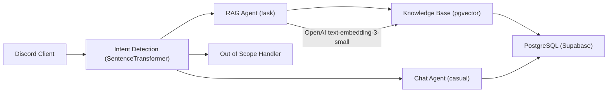

# PRD – Discord RAG Agent para Sala de Estudos (Concursos Públicos)

## 1. Visão Geral

Bot Discord especializado em **auxílio para concursos públicos** voltado a grupos de estudo distribuídos geograficamente. O agente usa RAG com base de conhecimento curada (legislação, doutrina, jurisprudência, questões) para **minimizar alucinações** e fornecer respostas precisas e didáticas via comando `!ask`. Mantém capacidade conversacional para interações casuais, mas prioriza rigor técnico quando solicitado explicitamente.

### Problema a Resolver

Em concursos públicos, **cada palavra/expressão pode ser decisiva** entre aprovação e reprovação após anos de estudo. Respostas genéricas ou alucinadas de LLMs comprometem a preparação. O bot precisa:

- Responder **apenas com base em fontes confiáveis** (RAG rigoroso).
- Indicar claramente quando não souber a resposta.
- Ser didático sem divagar.

### Objetivos

1. **Precisão acima de tudo**: Minimizar alucinações ao máximo em respostas de estudo (`!ask`) (meta: ≤1% de alucinações detectadas — ver NFR-1).
2. **Didática**: Explicações objetivas e compreensíveis.
3. **Dual-mode**: Rigoroso em `!ask`, conversacional em chat livre.
4. **Sempre disponível**: 24/7 para grupo em diferentes fusos horários.

---

## 2. Público-Alvo e Contexto de Uso

### Público

- Grupo de amigos concurseiros de diferentes estados do Brasil.
- Estudantes para concursos (Direito, Administrativo, outras áreas).
- Usuários técnicos que entendem limitações de IA (sabem diferenciar resposta factual de opinião).

### Contexto de Uso

**"Salinha de Estudo" no Discord** (comum em comunidades de concurseiros):

- Canal principal para `!ask` (perguntas de estudo).
- Canais secundários para conversas casuais.
- Threads para discussões longas sobre tópicos específicos.
- DMs para dúvidas privadas.

---

## 3. Escopo Funcional (MVP)

### 3.1. Comando `!ask` — Modo Estudo Rigoroso

#### FR-1: Comando `!ask` para perguntas de concurso

```bash
!ask quais qualificadoras existem no crime de homicídio?
```

**Comportamento esperado:**

- Busca semântica na base RAG (legislação + doutrina + questões).
- Resposta estruturada:

  ```markdown
  📚 **Crime de Homicídio - Qualificadoras (Art. 121, §2º, CP)**

  As qualificadoras do homicídio são:

  I - Mediante paga ou promessa de recompensa, ou por motivo torpe;
  II - Por motivo fútil;
  III - Com emprego de veneno, fogo, explosivo, asfixia, tortura ou outro meio insidioso ou cruel;
  IV - À traição, de emboscada, ou mediante dissimulação;
  V - Para assegurar a execução, ocultação, impunidade de outro crime.

  💡 **Didática**: Qualificadoras são circunstâncias que agravam a pena (reclusão de 12 a 30 anos). Dividem-se em subjetivas (incisos I, II, V) e objetivas (incisos III, IV).

  📖 **Fonte**: Código Penal, Art. 121, §2º | Doutrina: Rogério Greco
  ```

- **Indicadores de confiança**:
  - ✅ Resposta com fonte → alta confiança.
  - ⚠️ Resposta sem fonte exata → "Com base no conhecimento geral, mas verifique em [sugestão de fonte]".
  - ❌ Não encontrou → "Não localizei informação precisa na base. Recomendo consultar [fonte oficial]".

#### FR-2: Anti-Alucinação

- Proibir invenção de artigos, incisos, jurisprudência.
- Sempre citar a fonte exata (lei, artigo, livro, página quando disponível).
- Se a base RAG não contiver informação suficiente:

  ```markdown
  ❌ Não encontrei informação suficiente na base de estudos.
  💡 Sugestão: Consulte o Código Penal, arts. 121-122, ou a obra "Curso de Direito Penal" de Rogério Greco.
  ```

#### FR-3: Estrutura de Resposta Didática

- Resposta direta (2-3 parágrafos máximo).
- Seção "Didática" opcional para contexto.
- Fonte sempre citada.
- Sem divagações ou histórias.

---

### 3.2. Modo Conversacional — Chat Livre

#### FR-4: Conversas casuais sem `!ask`

Quando o usuário **não usar `!ask`**, o bot age como assistente conversacional normal:

```markdown
Usuário: e aí, como vai?
Bot: Opa, tudo tranquilo por aqui! 😊 Como estão os estudos? Alguma matéria pegando?

Usuário: tá chato estudar sozinho
Bot: Entendo total, estudar para concurso é bem solitário mesmo. Mas vocês têm essa galera aqui pra trocar ideia, isso já ajuda bastante! Tá travando em algum assunto específico ou só bateu o cansaço?
```

**Regras do modo conversacional:**

- Tom amigável, apoiador.
- Pode dar conselhos gerais sobre estudo, motivação, organização.
- **Não dá respostas técnicas de matérias** nesse modo (só em `!ask`).
- Pode puxar conversa sobre temas gerais, hobbies, desabafos.

---

### 3.3. RAG Rigoroso com Base Curada

#### FR-5: Base de Conhecimento (data/concursos/)

Estrutura de pastas:

```text
data/concursos/
├── legislacao/
│   ├── codigo_penal.pdf
│   ├── constituicao_federal.pdf
│   ├── codigo_processo_civil.pdf
│   └── leis_especiais/
├── doutrina/
│   ├── direito_penal_rogério_greco.pdf
│   ├── direito_constitucional_pedro_lenza.pdf
│   └── direito_administrativo_matheus_carvalho.pdf
├── questoes_comentadas/
│   ├── cespe_direito_penal.pdf
│   ├── fcc_constitucional.pdf
│   └── fundatec_administrativo.pdf
├── jurisprudencia/
│   ├── stf_informativos.pdf
│   └── stj_sumulas.pdf
```

#### FR-6: Ingestão e Chunking

- PDFs processados com `PDFKnowledgeBase`.
- Chunks de 512-1024 tokens com overlap de 128.
- Metadados: fonte, autor, página, área do direito.
- Embeddings em Supabase (pgvector) com `text-embedding-3-small`.

#### FR-7: Busca Semântica + Reranking

- Top-k=5 resultados iniciais.
- Reranking por relevância + tipo de fonte (legislação > doutrina > questões).
- Threshold mínimo de similaridade (0.7) para considerar resultado válido.

#### FR-8: Citação Obrigatória

- Sempre incluir: `[Fonte: Nome | Página X]` ou `[Art. Y, Lei Z]`.
- Se múltiplas fontes, listar todas.

---

### 3.4. Memória e Contexto

#### FR-9: Session Memory por Thread

- Cada thread Discord = 1 sessão.
- Últimas 5 interações no contexto.
- Resumo automático após 20 mensagens.

#### FR-10: User Memory (Preferências de Estudo)

- Guardar por usuário:
  - Áreas de interesse (ex.: "Direito Penal", "Constitucional").
  - Nível (iniciante, intermediário, avançado).
  - Preferência de resposta (ex.: "prefiro exemplos práticos").
  - Histórico de dúvidas frequentes.

Exemplo:

```python
user_memory = {
    "gabriel_ramos": {
        "áreas": ["Direito Constitucional", "Direito Penal"],
        "nivel": "avançado",
        "preferências": ["respostas concisas", "exemplos de questões"],
        "última_dúvida": "qualificadoras homicídio"
    }
}
```

> **Nota de implementação:** As chaves mostradas acima usam acentos apenas para legibilidade do exemplo.
> No código real, usar chaves ASCII sem acentos: `areas`, `nivel`, `preferencias`, `ultima_duvida`.
> Isso previne problemas de encoding em banco de dados e serialização JSON.

```python
# Chaves recomendadas para produção
user_memory = {
    "gabriel_ramos": {
        "areas": ["Direito Constitucional", "Direito Penal"],
        "nivel": "avançado",
        "preferencias": ["respostas concisas", "exemplos de questões"],
        "ultima_duvida": "qualificadoras homicídio"
    }
}
```

#### FR-11: Não guardar dados sensíveis

- Não armazenar: dados pessoais, CPF, órgão pretendido, etc.
- Apenas preferências de estudo e interações técnicas.

---

### 3.5. SOUL.md — Personalidade Dual

#### FR-12: Personalidade definida em `SOUL.md`

```markdown
# SOUL - Assistente de Concursos Públicos

## Identidade

Sou um assistente especializado em concursos públicos brasileiros, focado em **precisão e didática**. Ajudo grupos de estudo com dúvidas técnicas baseadas em fontes confiáveis.

## Modo Operacional

### 🎯 Modo Estudo (comando `!ask`)

- **Prioridade absoluta**: Precisão e minimização de alucinações (meta: ≤1%)
- **Base**: Apenas conhecimento da base RAG (legislação, doutrina, questões)
- **Tom**: Técnico, didático, objetivo
- **Formato**: Resposta direta + contexto didático + fonte obrigatória
- **Limites**: Se não sei, digo claramente e sugiro fonte oficial

### 💬 Modo Conversacional (chat livre)

- **Prioridade**: Apoio e motivação
- **Base**: Conhecimento geral sobre estudo, organização, bem-estar
- **Tom**: Amigável, empático, encorajador
- **Formato**: Conversa natural, pode perguntar de volta, dar conselhos gerais
- **Limites**: Não dou respostas técnicas de matérias neste modo (só em `!ask`)

## Valores

1. **Precisão > Velocidade**: Melhor responder "não sei" que alucinar
2. **Fonte sempre**: Toda informação técnica tem origem identificável
3. **Didática**: Explicar de forma que iniciantes entendam
4. **Empatia**: Estudar para concurso é difícil, reconheço o esforço

## Restrições

- Nunca inventar artigos, leis, jurisprudência ou autores
- Nunca dar "dicas de prova" sem base
- Nunca fazer julgamentos sobre escolha de carreira
- Nunca dar opinião política/ideológica
```

---

### 3.6. Context Engineering Específico

#### FR-13: Intent Detection — Modo Automático

Classificar mensagem em:

- `study_question` → Roteamento para RAG rigoroso (equivalente a `!ask`).
- `casual_chat` → Modo conversacional.
- `motivational_support` → Apoio emocional/motivacional.
- `study_organization` → Dicas de organização, cronograma, etc.

```python
# Exemplos de treinamento
intents = {
    "study_question": [
        "quais qualificadoras existem no homicídio",
        "explica princípio da legalidade",
        "diferença entre dolo eventual e culpa consciente",
    ],
    "casual_chat": [
        "e aí, como vai",
        "to cansado hoje",
        "viu o jogo ontem",
    ],
    "motivational_support": [
        "to pensando em desistir",
        "não aguento mais estudar",
        "tá muito difícil",
    ],
    "out_of_scope": [
        "qual o sentido da vida",
        "cadê meu celular",
        "como faço bolo de cenoura",
        "quem vai ganhar o campeonato",
    ],
}
```

> **Roteamento `out_of_scope`:** Quando a intent detectada for `out_of_scope`, o bot deve responder com:
> "Não consigo ajudar com isso, mas posso te ajudar com dúvidas de estudo (`!ask`) ou bater um papo sobre a rotina de concurseiro!"

```markdown
# Exemplos de uso do out_of_scope

!ask o que é a vida?
-> "Não consigo ajudar com isso, mas posso te ajudar com dúvidas de estudo (!ask) ou bater um papo sobre a rotina de concurseiro!"
```

- Mesmo em conversa casual, `!ask` força modo estudo.
- Garante que usuário sempre pode obter resposta técnica explicitamente.

#### FR-15: Context Reduction para Sessões Longas

- Se thread tiver > 50 mensagens, resumir histórico.
- Preservar: tema principal, dúvidas já respondidas, preferências.
- Logs de resumo para auditoria.

---

### 3.7. Observabilidade e Confiabilidade

#### FR-16: Heartbeat e Health Check

- Heartbeat a cada 60s.
- Métricas:
  - `!ask` respondidos (total, com fonte, sem fonte).
  - Conversas casuais.
  - Erros de RAG (busca vazia).
  - Latência média.

#### FR-17: Logs Estruturados

Cada `!ask` registra:

```json
{
  "timestamp": "2026-02-17T15:13:00-03:00",
  "user_id": "gabriel_ramos#1234",
  "command": "!ask",
  "question": "quais qualificadoras existem no crime de homicídio?",
  "intent": "study_question",
  "confidence": 0.95,
  "rag_results": 5,
  "sources": ["CP Art. 121 §2º", "Rogério Greco p.342"],
  "response_length": 450,
  "latency_ms": 2340,
  "user_feedback": null
}
```

#### FR-18: Comando `!report` para Feedback

```bash
!report [id_mensagem?] [correto|incorreto|incompleto] [comentário]
```

Usuários podem marcar respostas incorretas para revisão e melhoria da base.

**Resolução do `id_mensagem` (opcional):**

1. Se o `!report` for uma **resposta (reply)** a uma mensagem do bot → usar o ID da mensagem referenciada automaticamente.
2. Se não for reply e não tiver ID explícito → buscar a **última mensagem do bot** no canal/thread atual.
3. Se nenhuma das estratégias funcionar → retornar erro claro: "Não consegui identificar qual mensagem reportar. Responda diretamente à mensagem ou forneça o ID."

**Fluxo completo:**

- Após registrar o report, o bot envia confirmação ao usuário.
- Admins com role autorizada recebem notificação com: mensagem original, fontes RAG usadas, comentário do usuário.

---

## 4. Requisitos Não Funcionais

### NFR-1: Precisão (Crítico)

- ≥ 95% das respostas `!ask` com fonte citada.
- ≤1% de alucinações detectadas em auditorias mensais (meta aspiracional: <0.5%).
- Quando incerto, sempre indicar explicitamente.

### NFR-2: Latência

- `!ask` com RAG: < 5s (p95).
- Chat casual: < 2s (p95).
- Busca vetorial otimizada (índices no pgvector).

### NFR-3: Disponibilidade

- Uptime ≥ 99% em horários de estudo (6h-23h, todos os dias).
- Reconexão automática se Discord cair.

### NFR-4: Escalabilidade

- Suportar até 10 usuários simultâneos (grupo pequeno).
- Pronto para escalar para 50+ se comunidade crescer.

### NFR-5: Custo

- Context reduction para limitar tokens (≤ 4k tokens/mensagem).
- **Estratégia dual de embeddings:**
  - **Memória semântica (recall):** OpenAI `text-embedding-3-small` via API — maior precisão para busca RAG.
  - **Classificação de intents:** SentenceTransformer `all-MiniLM-L6-v2` local — sem custo de API, baixa latência.
- Mitigações de custo: batching, caching de embeddings, rate limiting de requests à API.

> **Nota:** Chaves e nomes de campos em tabelas `user_memory` / `agent_*` devem usar apenas caracteres ASCII (sem acentos).

### NFR-6: Segurança

- Segredos em `.env` (nunca commitados).
- Logs não contêm dados pessoais identificáveis.
- Comandos admin (`!admin`, `!health`) apenas para roles autorizadas.

---

## 5. User Stories (Revisadas)

### US-001: Pergunta Técnica com RAG Rigoroso

**Como** concurseiro estudando Direito Penal,
**Quero** perguntar `!ask quais qualificadoras existem no crime de homicídio?`
**Para** obter resposta precisa com artigos e fontes, sem risco de alucinação.

**Critérios de Aceitação:**

- [ ] Resposta lista todas as qualificadoras do Art. 121, §2º, CP.
- [ ] Resposta inclui seção didática explicando divisão subjetivas/objetivas.
- [ ] Fonte citada: "Código Penal, Art. 121, §2º | Doutrina: Rogério Greco".
- [ ] Se não encontrar, diz: "Não localizei informação precisa. Consulte CP arts. 121-122".
- [ ] Log registra: pergunta, intent `study_question`, 5 resultados RAG, fontes usadas.

---

### US-002: Conversa Casual sem Modo Estudo

**Como** concurseiro cansado do dia,
**Quero** conversar normalmente com o bot sem ser bombardeado com informações técnicas,
**Para** descontrair e manter o grupo ativo.

**Critérios de Aceitação:**

- [ ] Mensagem "e aí, como vai?" → Bot responde conversacionalmente sem citar legislação.
- [ ] Bot pergunta de volta, demonstra empatia, pode dar conselhos gerais sobre estudo.
- [ ] **Não** entra em modo técnico (não cita artigos, leis, doutrina).
- [ ] Se usuário quiser resposta técnica, sugere: "Se quiser detalhes técnicos, usa `!ask [sua pergunta]`".

---

### US-003: Indicação Clara de Incerteza

**Como** concurseiro,
**Quero** que o bot diga claramente quando não sabe a resposta,
**Para** não estudar informação errada e reprovar.

**Critérios de Aceitação:**

- [ ] Pergunta fora da base RAG → Bot responde: "❌ Não encontrei informação precisa na base. Recomendo consultar [fonte oficial]".
- [ ] Bot **nunca** inventa artigos, incisos ou jurisprudência.
- [ ] Se similaridade < 0.7 nos resultados RAG → Bot indica baixa confiança.
- [ ] Log registra `rag_results: 0` ou `low_confidence: true`.

---

### US-004: Feedback de Correção

**Como** concurseiro que encontrou erro,
**Quero** marcar a resposta como incorreta com `!report`,
**Para** que o grupo possa revisar e melhorar a base de conhecimento.

**Critérios de Aceitação:**

- [ ] Comando `!report [id_mensagem] incorreto "Art. 121 §2º tem inciso VI também"`.
- [ ] Bot registra report em `agent_metrics` ou tabela dedicada.
- [ ] Admin recebe notificação para revisar.
- [ ] Report inclui: mensagem original, RAG sources usadas, comentário do usuário.

---

### US-005: Memória de Preferências de Estudo

**Como** concurseiro Gabriel,
**Quero** que o bot lembre que estudo Direito Constitucional e Penal nível avançado,
**Para** receber respostas mais contextualizadas sem repetir isso toda hora.

**Critérios de Aceitação:**

- [ ] Após declarar "estudo principalmente Direito Penal e Constitucional", preferência é gravada.
- [ ] Em futuras respostas, bot prioriza doutrina dessas áreas.
- [ ] Em respostas didáticas, ajusta nível (menos básico, mais aprofundado).
- [ ] Comando `!minhas-preferencias` exibe o que está armazenado.
- [ ] Comando `!limpar-preferencias` apaga tudo.

---

## 6. Arquitetura Técnica

```text
┌─────────────────────────────────────────────────────────┐
│                    Discord Client                        │
│  - Eventos de mensagem                                   │
│  - Detecção de comando (!ask, !report, !health)          │
└────────────────┬────────────────────────────────────────┘
                 │
                 ▼
┌─────────────────────────────────────────────────────────┐
│              Intent Detection (local)                    │
│  - Sentence Transformer (all-MiniLM-L6-v2)              │
│  - Classifica: study_question | casual_chat | support   │
└────────────────┬────────────────────────────────────────┘
                 │
         ┌───────┴────────┐
         ▼                ▼
┌──────────────┐   ┌──────────────┐
│ RAG Agent    │   │ Chat Agent   │
│ (!ask mode)  │   │ (casual mode)│
└──────┬───────┘   └──────────────┘
       │
       ▼
┌─────────────────────────────────────────────────────────┐
│           Knowledge Base (Supabase + pgvector)          │
│  - Legislação, Doutrina, Questões, Jurisprudência       │
│  - Embeddings: text-embedding-3-small                   │
│  - Busca vetorial + Reranking                           │
└─────────────────────────────────────────────────────────┘
       │
       ▼
┌─────────────────────────────────────────────────────────┐
│                    PostgreSQL (Supabase)                │
│  - agent_sessions (threads)                             │
│  - agent_memories (user preferences)                    │
│  - agent_metrics (logs, reports, heartbeat)             │
└─────────────────────────────────────────────────────────┘
```

**Diagrama alternativo (Mermaid):**



---

## 7. Fases de Desenvolvimento

### Fase 1: MVP — RAG + `!ask` (2 semanas)

- [ ] Setup Supabase + pgvector.
- [ ] Ingestão da base inicial (CP, CF, 1-2 livros de doutrina).
- [ ] Agente básico com comando `!ask`.
- [ ] Anti-alucinação: citação obrigatória de fontes.
- [ ] Deploy em servidor/container com `uv`.

### Fase 2: Dual-Mode + Intent (1 semana)

- [ ] Intent detection local (sentence transformer).
- [ ] Modo conversacional sem `!ask`.
- [ ] SOUL.md implementado.
- [ ] Testes com grupo.

### Fase 3: Memória + Observability (1 semana)

- [ ] User memory (preferências de estudo).
- [ ] Session memory com resumos.
- [ ] Heartbeat + métricas.
- [ ] Comando `!report` para feedback.
- [ ] Logs estruturados.

### Fase 4: Otimização + Expansão da Base (ongoing)

- [ ] Context reduction para threads longas.
- [ ] Reranking avançado.
- [ ] Adicionar mais materiais (questões, informativos STF/STJ).
- [ ] Fine-tuning de prompts baseado em feedbacks.

---

## 8. Métricas de Sucesso

### Fase MVP (mês 1)

- ≥ 90% das respostas `!ask` com fonte citada.
- ≤1% de alucinações reportadas via `!report`.
- ≥ 80% de satisfação do grupo (pesquisa qualitativa).

### Produção (meses 2-6)

- ≥ 95% das respostas com fonte.
- Latência p95 < 5s para `!ask`.
- Uptime ≥ 99% em horários de estudo.
- ≥ 50 materiais na base de conhecimento.
- Feedback positivo de ≥ 90% dos usuários ativos.

---

## 9. Riscos e Mitigações

| Risco                                            | Impacto  | Mitigação                                                             |
| ------------------------------------------------ | -------- | --------------------------------------------------------------------- |
| **Alucinação crítica** (resposta técnica errada) | 🔴 Alto  | RAG rigoroso + threshold de confiança + comando `!report`             |
| **Base de conhecimento desatualizada**           | 🟡 Médio | Pipeline de atualização mensal + avisos de versão                     |
| **Custo de API elevado**                         | 🟡 Médio | Context reduction + embeddings locais + cache de respostas frequentes |
| **Latência alta em horário de pico**             | 🟢 Baixo | Grupo pequeno (<10 usuários), escala gradual                          |
| **Perda de dados (Supabase down)**               | 🟡 Médio | Backup semanal + fallback para modo local temporário                  |

---

## 10. Próximos Passos

1. **Validação com o grupo**: Apresentar PRD, coletar feedback sobre funcionalidades.
2. **Setup inicial**: Criar projeto com `uv`, configurar Supabase, estrutura de pastas.
3. **Primeira ingestão**: Começar com CP + CF + 1 livro de Direito Penal.
4. **Protótipo `!ask`**: Testar em canal privado de teste antes de liberar para grupo.
5. **Iteração**: Ajustar com base em uso real (primeira semana crítica).

---

## 11. Documentação Viva

Este PRD é um documento vivo e deve ser atualizado conforme o projeto evolui. Alterações em requisitos, arquitetura ou escopo devem ser refletidas aqui para manter a rastreabilidade.

**Próximo passo:** Transformar os requisitos acima em backlog de desenvolvimento com issues/tasks no GitHub.

## 12. Referências

- [Milvus — Building Production-Ready Multi-Agent Systems with Agno](https://milvus.io/blog/how-to-build-productionready-multiagent-systems-with-agno-and-milvus.md) — Referência de arquitetura multi-agente (o projeto usa Supabase + pgvector, não Milvus).
- [Supabase pgvector](https://supabase.com/docs/guides/ai/vector-columns) — Documentação do backend vetorial utilizado.
